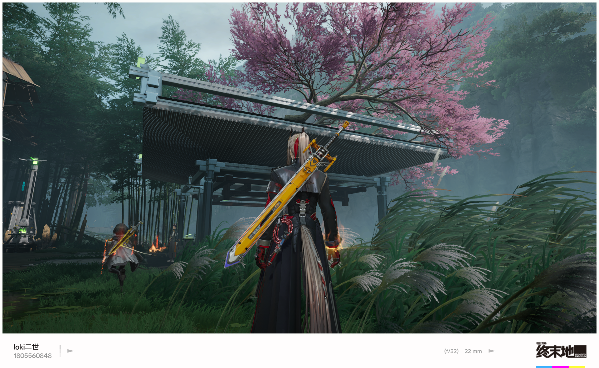
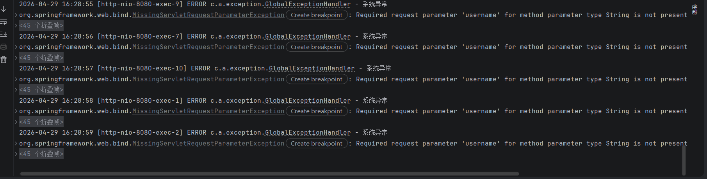

## 🪨 58K一桶岩浆生炸刷石机 — 完整使用指南

### 存档概览

欢迎使用基于 **58K一桶岩浆** 的无限生炸刷石机存档！本存档适用于 Minecraft 1.21.10 版本，使用 Fabric 0.18.0 模组加载器。

| 项目 | 详情 |
|------|------|
| 游戏版本 | Minecraft 1.21.10 |
| 模组加载器 | Fabric 0.18.0 |
| 存档类型 | 原版生存 |
| 核心机制 | 58K桶岩浆 + TNT复制 |
| 产量 | ~18,000 石头/小时 |

---

### 工作原理

> **核心思路**：利用 58K 桶岩浆的无限热源驱动刷石机，配合 TNT 复制装置实现自动爆破采集。

整个装置分为三个模块：

1. **无限岩浆源** — 使用 58K 桶岩浆实现
2. **自动刷石机** — 高效 TNT 复制刷石装置
3. **全自动收集系统** — 自动收集石料资源

---

### 装置结构展示

#### ① 游戏内刷石机全景

*上图：刷石机主体结构，包含岩浆源、水流通道和TNT爆破舱*

#### ② 红石控制面板

*上图：刷石机红石控制电路*

#### ③ 收集系统产出结果

*上图：全自动收集系统终端*

---

### 快速上手

1. 下载并解压存档文件
2. 将解压后的文件夹放入 `.minecraft/saves/` 目录
3. 使用 Fabric 0.18.0 启动游戏
4. 进入存档，输入 `/tp @p 128 70 128` 传送至刷石机
5. 拉下控制杆即可启动全自动生产
